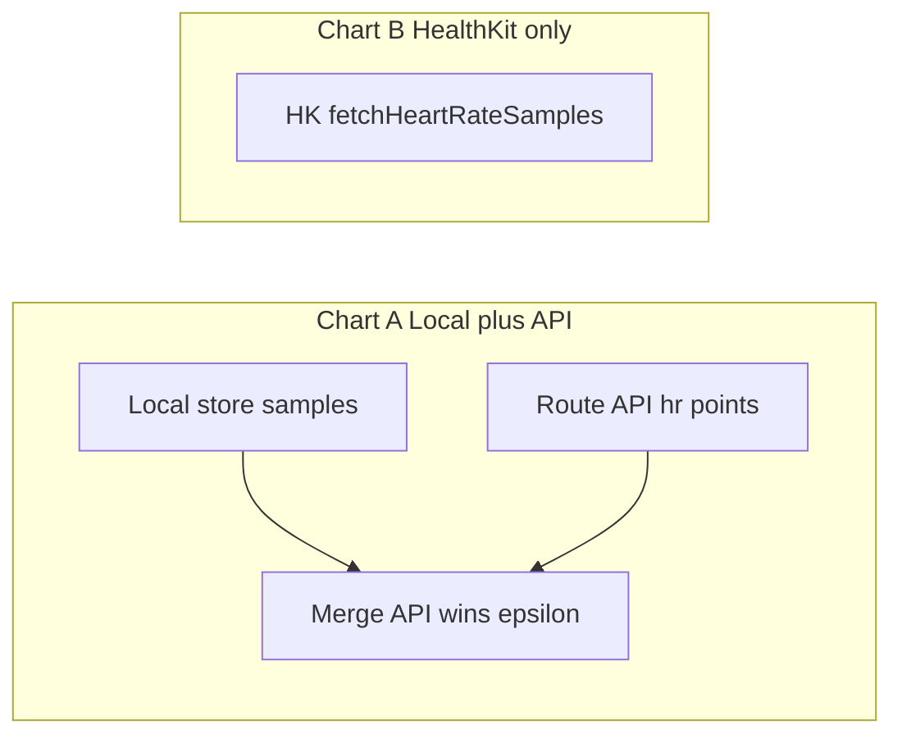

# 12-hour metrics: aggressive local HR + dual HR charts (Local+API vs HealthKit)

## Goals

1. **Richer HR history** — Persist BPM **more often than MQTT location publishes** (waypoints are sparse). Enables a denser 12h view on-device.
2. **Comparison UX (temporary)** — In the metrics modal, **two** heart rate charts for **own device only**:
   - **Chart A — “Local + API”**: Base series from the **local store**, with **route API** HR overlaid where the backend has samples (API wins at overlapping times).
   - **Chart B — “HealthKit”**: **Only** anchored HK samples (existing `fetchHeartRateSamples` path), unchanged by API/local merge—lets you compare “strap/phone pipeline + server” vs “Apple Health” while deciding product direction.
3. **Friends** — No local store, no dual chart; keep current behavior (waypoint HR + route overlay as today).

## Current code anchors

- VM: [`OwnTracks/OwnTracks/DeviceDetailViewModel.swift`](OwnTracks/OwnTracks/DeviceDetailViewModel.swift) — `heartRateHistoryLookbackSeconds`, `applyRouteHistoryPointsToMetricsCharts` (`preserveOwnHeartRate` blocks API HR for self), `refreshHeartRateHistoryFromHealthKit`, `rebuildMetricsChartSeries`.
- UI: [`OwnTracks/OwnTracks/DeviceMetricsChartsSheet.swift`](OwnTracks/OwnTracks/DeviceMetricsChartsSheet.swift) — single `AlignedMetricChart` for HR; `data.count >= 2` for a line.
- Publish path (sparse HR): [`OwnTracks/OwnTracks/OwnTracksAppDelegate.m`](OwnTracks/OwnTracks/OwnTracksAppDelegate.m) + [`OTHeartRateMonitoring.m`](OwnTracks/OwnTracks/OTHeartRateMonitoring.m).

## 1. Local HR store (aggressive sampling)

**What to store:** `(timestamp: Date, bpm: Int)` append-only log, trimmed to a **rolling window** (e.g. **24h** retained, **12h** displayed) to survive overnight sessions.

**Where:** Application Support directory, e.g. `HeartRateLocalSamples.json` — array of `{ "t": unix, "bpm": n }`. On launch, load, sort, trim by `t`. Avoid Core Data migration for this experiment.

**When to append (cadence):**

- **Timer-based** while `OTHeartRateMonitoring isMonitoringEnabled` and app is **active** (simplest, predictable): e.g. every **15–30s** read `resolvedHeartRateBPMWithMaxSampleAge:...` and append if BPM &gt; 0.
- **Optional supplement:** on `OTBluetoothHeartRateDidUpdateNotification`, append only if **≥ minSpacing** since last write (e.g. **10s**) so rapid BLE notifications do not hammer disk.
- **Background:** defer v1 to foreground; note that background BLE updates are possible later but complicate lifecycle.

**Source of BPM at sample time:**

- **Default (recommended for parity with MQTT):** same as waypoint — `OTHeartRateMonitoring resolvedHeartRate...` so local line matches what would be published when a fix arrives.
- **Alternative:** BLE-only from `BluetoothHeartRateManager` for “raw strap” density; document if you choose this so API/HK comparisons stay interpretable.

**Privacy / size:** cap array length (e.g. max ~10k entries) and file size; trim aggressively.

**New type (suggested):** `OTLocalHeartRateTimeSeriesStore` (ObjC or Swift with `@objc` for AppDelegate/Location paths if needed) — `appendSample(date:bpm:)`, `samples(from:to:)`, `trim(olderThan:)`.

**Wiring:** Instantiate singleton; start/stop timer with app foreground + HR monitoring enabled (observe `OTHeartRateMonitoringEnabledDidChangeNotification` or equivalent). Do not record when monitoring is off.

## 2. Merge: Local + API (Chart A)

**Inputs:**

- `localSamples` — from store, clipped to chart `[metricsChartStart, metricsChartEnd]`.
- `apiSamples` — parsed from route `GET` points (`hr` / `heartRate`, same unix helper as today), own device only.

**Algorithm (deterministic):**

1. Sort `localSamples` by time.
2. For each API point `(t_a, v_a)`, remove any local points with `|t_local - t_a| ≤ epsilon` (suggest **30s**; tunable) so **API overlays** dense local noise at the same event.
3. Concatenate remaining local + all API, sort by time.
4. Optional light dedupe: if two identical BPM within 1s, collapse (cosmetic).

**Chart eligibility:** reuse **≥2 points** rule for `AlignedMetricChart`; subtitle if only 0–1 points (“Not enough data in this window.”).

**VM properties (names illustrative):**

- `@Published var metricsChartLocalPlusApiHeartRateHistory: [(date: Date, value: Double)]`
- Keep existing `heartRateHistory` as the **raw HK list** for Chart B, or rename internally for clarity (`healthKitHeartRateHistory`).

**Recompute triggers:** local file updated (after append), route `applyRouteHistoryPointsToMetricsCharts`, `rebuildMetricsChartSeries` (window shift), `populate`, sheet `onAppear`.

## 3. HealthKit-only chart (Chart B)

- Populate **only** from `HealthKitHeartRateManager.fetchHeartRateSamples` into a dedicated `@Published` series used **exclusively** by the second chart.
- **Do not** fold HK into Chart A for this comparison phase (user explicitly wants HK separate).
- If Health data unavailable or authorization blocks reads: show second chart with same empty-state copy or a one-line caption (“HealthKit unavailable”).

## 4. UI changes — [`DeviceMetricsChartsSheet.swift`](OwnTracks/OwnTracks/DeviceMetricsChartsSheet.swift)

- Add **`vm`-exposed flag** e.g. `showsExperimentalDualHeartRateCharts` derived from `isOwnWaypoint` (could be internal to VM as `var isOwnWaypoint: Bool { ... }` exposed read-only).
- When true:
  - First HR block: title **“Heart rate (local + server)”** (localized), `data: vm.metricsChartLocalPlusApiHeartRateHistory`, caption explaining merge.
  - Second HR block: title **“Heart rate (Apple Health)”**, `data: vm.healthKitOnlyHeartRateHistory` (or existing `heartRateHistory` if renamed).
- When false (friends): **one** HR chart — existing behavior (waypoints + API as implemented for friends).

Scrubbing: today scrub is shared via `scrubTime`. **Options:** (a) share one scrub across both HR charts for easy time alignment; (b) separate scrub state per chart—**(a)** is better for comparison; extend `AlignedMetricChart` or pass both series into nearest-point readout if you show two values at scrub time (future polish).

## 5. Route API parsing for own device

- Remove **`preserveOwnHeartRate`** gating that skips HR extraction for self; always parse API HR into `lastRouteApiHeartRateSamples` for merge into Chart A only.
- Speed/alt/batt overlay logic stays as-is.

## 6. Ordering summary (clarified vs earlier plan)

| Chart | Data |
|-------|------|
| **A — Local + API** | Local aggressive store, API overlays on conflict |
| **B — HealthKit** | HK samples only |

No single “cascade” chart anymore for the experiment—comparison is the point.

## 7. Files to touch

| File | Role |
|------|------|
| New `OTLocalHeartRateTimeSeriesStore` (or Swift equivalent in `OwnTracks/OwnTracks/`) | Persist + query + trim |
| [`OwnTracksAppDelegate.m`](OwnTracks/OwnTracks/OwnTracksAppDelegate.m) or small **foreground** coordinator | Start/stop sampling timer with app/scene lifecycle |
| [`DeviceDetailViewModel.swift`](OwnTracks/OwnTracks/DeviceDetailViewModel.swift) | Dual series, merge helper, parse API HR for self, HK-only field |
| [`DeviceMetricsChartsSheet.swift`](OwnTracks/OwnTracks/DeviceMetricsChartsSheet.swift) | Conditional second HR chart + copy |
| [`Sauron.xcodeproj`](OwnTracks/Sauron.xcodeproj) / target sources | Add new store file to target |

## 8. Manual test matrix

- Monitoring on, walk with strap: local file grows faster than waypoint count; Chart A denser than waypoint-only baseline.
- Route history with `hr`: Chart A shows API-aligned bumps overlaying local.
- HK authorized: Chart B matches Health app density; Chart A unchanged by HK.
- HK denied: Chart B empty message; Chart A still useful.
- Friend detail: still one HR chart.

## 9. Follow-up (after you pick a winner)

- Remove dual chart, collapse to one series, or promote local+API as production and keep HK as optional detail.

