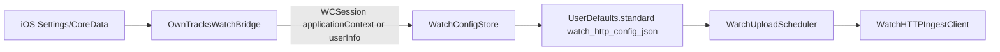

# CLAUDE.md — OwnTracks iOS (Sauron Fork)

This file is the canonical reference for AI assistants working in this repository.

---

## Project Identity

| Field | Value |
|---|---|
| App name | OwnTracks iOS (internal fork) |
| Codename | **Sauron** |
| Bundle ID | `org.laskatj.owntracksfork` |
| Keychain group | `org.mqttitude.MQTTitude` (legacy) |
| App group | `group.org.owntracks.OwnTracks` |
| Version | 19.2.7 |
| Deployment target | iOS 16.0+ / tvOS 16.0+ / watchOS 10.0+ |
| Language | **Objective-C** main app; **SwiftUI** watchOS companion |
| Dev team | `CFR426ZH5P` |
| Build number | `git rev-list --count HEAD` |
| Xcode workspace | `OwnTracks/Sauron.xcworkspace` |

---

## Repository Layout

```
owntracks-ios/
├── OwnTracks/
│   ├── Sauron.xcworkspace/         # Always open this, not .xcodeproj
│   ├── Sauron.xcodeproj/           # Project file (do not open directly)
│   ├── Podfile                     # CocoaPods manifest
│   ├── Pods/                       # Generated — never edit manually
│   ├── OwnTracks/                  # Main app source (Objective-C)
│   │   ├── coredata/               # Core Data model + migrations
│   │   ├── *.m / *.h               # All source files (flat layout)
│   │   ├── MQTT.plist              # MQTT defaults
│   │   ├── HTTP.plist              # HTTP/OIDC defaults
│   │   └── OwnTracks-Info.plist    # App bundle info
│   ├── OwnTracksIntents/           # Siri Shortcuts extension
│   ├── OwnTracksTests/             # Unit tests
│   ├── SauronWatch/                # SwiftUI watchOS companion app
│   ├── SauronWatchWidget/          # WidgetKit complication extension
│   └── SauronTV/                   # tvOS application
├── ImageSources/                   # SVG originals for icons/assets
├── CLAUDE.md                       # This file
├── README.md                       # Setup instructions
├── CHANGELOG.md                    # Version history
├── essential_features_extract.md   # Feature extraction notes
└── .github/                        # FUNDING.yml
```

---

## Build System

**Always open `OwnTracks/Sauron.xcworkspace`** — never `Sauron.xcodeproj` directly, as CocoaPods requires the workspace.

### Targets

| Target | Platform | Purpose |
|---|---|---|
| `Sauron` | iOS | Main application |
| `SauronIntents` | iOS | Siri Shortcuts extension |
| `SauronTV` | tvOS | TV companion app |
| `SauronWatch` | watchOS | SwiftUI watch companion app |
| `SauronWatchWidget` | watchOS | WidgetKit complication extension |
| `SauronTests` | iOS | Unit tests |

The iOS `Sauron` target embeds `SauronWatch.app` under **Embed Watch Content**. The watch app embeds `SauronWatchWidget.appex`. The checked-in schemes may not include a dedicated watch scheme; use the targets from `OwnTracks/Sauron.xcworkspace` if needed.

### CocoaPods Dependencies

Defined in `OwnTracks/Podfile`:

| Pod | Purpose |
|---|---|
| `mqttc/MinL` | MQTT v3/v4/v5 client (custom fork with `/ws` WebSocket path patch) |
| `CocoaLumberjack` | Logging with file rotation |
| `DSJSONSchemaValidation` | JSON schema validation |
| `Sodium` | libsodium cryptography |
| `ABStaticTableViewController` | Static table view base class |

After modifying `Podfile`, run `pod install` from the `OwnTracks/` directory, then reopen the workspace.

### Build Number

Build number is derived automatically:
```sh
git rev-list --count HEAD
```

---

## Architecture

### Patterns

- **Singleton managers** — all core services are accessed via `+sharedInstance`
- **`UITabBarController` navigation** — 7-tab main interface
- **Delegate protocols** — loose coupling between networking/location and UI
- **Core Data** — persistent storage with background + main thread contexts
- **NSThread subclass** — `Connection` runs its own networking thread

### Tab Structure

| Tab | Controller | Purpose |
|---|---|---|
| Map | `ViewController.m` | Native MKMapView, friend annotations |
| Friends | `FriendsTVC.m` | Friend list with detail |
| Regions | `RegionsTVC.m` | Geofence management |
| Tours | `ToursTVC.m` | Tour planning |
| History | `HistoryTVC.m` | Location history timeline |
| Web App | `WebAppViewController.m` | Embedded WKWebView + OIDC |
| Settings | `SettingsTVC.m` | MQTT/HTTP configuration |

---

## Key Source Files

All under `OwnTracks/OwnTracks/` (flat directory, no subdirectories except `coredata/`):

### Core Infrastructure

| File | Role |
|---|---|
| `OwnTracksAppDelegate.m/.h` | App lifecycle, `ConnectionDelegate`, `LocationManagerDelegate`, message dispatch, `sendNow:`, `status`, `waypoints` |
| `LocationManager.m/.h` | GPS, geofencing, motion activity, background wakeup, `backgroundWakeup` flag |
| `Connection.m/.h` | MQTT/HTTP networking thread (`NSThread` subclass), `sendData:topic:topicAlias:qos:retain:` |
| `OwnTracking.m/.h` | Message parsing, friend/region updates, topic routing, `publishStatus:` |
| `Settings.m/.h` | Preference management with Core Data backing, `theGeneralTopicInMOC:` |
| `CoreData.m/.h` | Core Data stack (`mainMOC`, `queuedMOC`), schema migration |

### Networking & Auth

| File | Role |
|---|---|
| `WebAppAuthHelper.m/.h` | OAuth 2.0/OIDC with PKCE, `ASWebAuthenticationSession`, Keychain refresh token storage, silent refresh |
| `WebAppURLResolver.m/.h` | Web app URL resolution and auto-provisioning discovery |
| `LocationAPISyncService.m/.h` | REST API polling for friend locations with OAuth bearer token |

### UI Controllers

| File | Role |
|---|---|
| `ViewController.m/.h` | Map tab: `MKMapViewDelegate`, `NSFetchedResultsControllerDelegate` |
| `WebAppViewController.m/.h` | WKWebView host, native OIDC token injection into web JS context |
| `FriendsTVC.m/.h` | Friends list |
| `RegionsTVC.m/.h` | Geofence list and editing |
| `ToursTVC.m/.h` | Tour planning |
| `HistoryTVC.m/.h` | Location history |
| `SettingsTVC.m/.h` | Settings UI |
| `OwnTracksEditTVC.m/.h` | Base class for all table view controllers |
| `TabBarController.m/.h` | Main `UITabBarController` orchestration |

### UI Components

| File | Role |
|---|---|
| `FriendAnnotationV.m/.h` | Map annotation view for friend locations |
| `PhotoAnnotationV.m/.h` | Photo attachment annotation |
| `FriendTableViewCell.m/.h` | Friend list cell |
| `ToursStatusCell.m/.h` | Tour status cell |
| `NavigationController.m/.h` | Navigation controller subclass |
| `ConnType.m/.h` | Connection mode enum |
| `NSNumber+decimals.m/.h` | Number formatting category |

### watchOS Companion

| File | Role |
|---|---|
| `SauronWatch/SauronWatchApp.swift` | SwiftUI watch app entry point; wires `WatchLocationTracker`, `WatchUploadScheduler`, and `WatchConfigStore` |
| `SauronWatch/ContentView.swift` | Watch UI for Passive/Active modes, Send Now, queue depth, upload status, and synced auth/config state |
| `SauronWatch/WatchSync/WatchConfigStore.swift` | `WCSessionDelegate`; receives iPhone HTTP config and persists `WatchHTTPConfig` |
| `SauronWatch/Tracking/WatchLocationTracker.swift` | Core Location tracking and Send Now one-shot location capture |
| `SauronWatch/Tracking/WatchTrackingPolicy.swift` | Passive/active sampling, upload cadence, queue limits, and optional ingest URL override |
| `SauronWatch/Tracking/WatchUploadScheduler.swift` | Drains the persisted watch location queue via HTTP with retry/backoff |
| `SauronWatch/Networking/WatchHTTPIngestClient.swift` | HTTP POST client mirroring iOS HTTP headers/auth behavior |
| `SauronWatch/Networking/LocationPayload.swift` | OwnTracks-compatible single and batch location JSON payload builder |
| `SauronWatch/Persistence/PendingLocationQueue.swift` | File-backed JSON queue at Application Support |
| `SauronWatch/WatchWidgetSync.swift` | Publishes queue/upload state to WidgetKit timelines |
| `SauronWatchWidget/SauronWatchWidget.swift` | WidgetKit complication for tracking mode, queue depth, and last upload |
| `OwnTracksWatchBridge.m/.h` | iOS-side WatchConnectivity bridge that pushes HTTP settings to the watch |

---

## Core Data

### Setup

- `mainMOC` — main thread; drives UI via `NSFetchedResultsController`
- `queuedMOC` — background thread; used by `Connection` and batch operations

### Entities

`Friend`, `Waypoint`, `Region`, `History`, `Queue`, `Setting`, `Validation`

### Model Location

`OwnTracks/OwnTracks/coredata/Model.xcdatamodeld/`

Current version: **18.4.3**. There are 34+ migration versions going back to 2015. Every schema change **must** include a new lightweight migration mapping model. Never modify an existing `.xcdatamodel` version.

---

## Key Protocols

### `ConnectionDelegate` (implemented by `OwnTracksAppDelegate`)

```objc
- (void)showState:(NSInteger)state;
- (void)handleMessage:(NSData *)data onTopic:(NSString *)topic retained:(BOOL)retained;
- (void)messageDelivered:(UInt16)msgID;
- (void)totalBuffered:(NSUInteger)count;
```

### `LocationManagerDelegate` (implemented by `OwnTracksAppDelegate`)

```objc
- (void)newLocation:(CLLocation *)location;
- (void)timerLocation:(CLLocation *)location;
- (void)visitLocation:(CLVisit *)visit;
- (void)regionEvent:(CLRegion *)region enter:(BOOL)enter;
- (void)regionState:(CLRegion *)region inside:(BOOL)inside;
- (void)beaconInRange:(CLBeacon *)beacon;
```

---

## Location Tracking Modes

| Mode | Description |
|---|---|
| **Manual** | User-triggered location send only |
| **SLC** | Significant Location Change — iOS background passive (~500m / cell change) |
| **Move** | Continuous GPS (`startUpdatingLocation`) while foreground; SLC fallback when backgrounded |
| **Passive** | Background tracking after app termination via SLC |
| **Visit** | `CLVisit` monitoring |

---

## Move + SLC Background Wakeup — Critical Detail

This is the most complex and fragile subsystem. Read carefully before modifying anything related to `backgroundWakeup`, `startBackgroundTimer`, `+follow` geofences, or `didUpdateLocations:`.

### Intent

In **Move mode**, continuous GPS runs while the app is in the foreground. When the app is backgrounded or terminated by iOS, continuous GPS stops. **SLC fallback** keeps tracking alive: iOS wakes the app (or relaunches it) when a significant location change is detected (~500m or cell tower change). On each wakeup the app publishes to MQTT, starts a disconnect timer, and suspends again.

### `backgroundWakeup` Flag

Set to `YES` in `OwnTracksAppDelegate didFinishLaunchingWithOptions:` when the app is relaunched by iOS via `UIApplicationLaunchOptionsLocationKey`. It gates all background-specific behavior:

- `LocationManager wakeup` — suppresses `startUpdatingLocation`; starts SLC + Visit monitoring only
- `OwnTracksAppDelegate publishLocation:` — updates the `+follow` geofence to current position
- `LocationManager startBackgroundTimer` — skipped when app state is FOREGROUND
- `LocationManager didUpdateLocations:` — uses a `-60.0s` time filter (vs `0.0`) to absorb iOS SLC timestamp jitter

### Timer Cascade on Each Background Wakeup

1. `holdTimer` (~10s) → triggers MQTT disconnect
2. `bgTimer` (1s polling) → checks if publish is complete
3. `disconnectTimer` (25s safety net) → force-disconnects if MQTT stalls

### `+follow` Geofence

A region whose name starts with `+` (e.g., `+30`) is a **follow region**. On every `publishLocation:` call (`OwnTracksAppDelegate.m` lines ~1697–1715), the follow geofence is re-centered at the user's current position with radius `max(speed × time_seconds, 50m)`. This means the follow region always wraps the user — when they move outside it, iOS fires a geofence exit, waking the app even if SLC has not fired independently.

### Known Issues (unfixed as of 19.2.7)

| Issue | Root Cause | Status |
|---|---|---|
| First SLC location silently dropped | `lastUsedLocation` initialized to `[NSDate date]` at launch; SLC timestamp predates launch | **Fixed** — reset to `distantPast` in background wakeup path |
| Second SLC silently dropped | iOS delivers SLC timestamp 43ms earlier than `lastUsedLocation` due to jitter | **Fixed** — time filter uses `-60.0s` threshold when `backgroundWakeup==YES` |
| MQTT never disconnects after first SLC | `startBackgroundTimer` was not called in background publish path | **Fixed** |
| `LocationAPISyncService` runs during wakeup | Service starts on every app launch including background relaunches; generates OAuth network traffic during the short wakeup window | **Known / not yet suppressed** |
| `+follow` geofence exit silently dropped in Move+backgroundWakeup | `regionEvent:enter:NO` in `OwnTracksAppDelegate.m:1005` skips publish when `monitoring == Move`; correct for foreground but wrong in backgroundWakeup | **Not yet fixed** — condition must also allow publish when `backgroundWakeup == YES` |

### Healthy Log Signature

```
[OwnTracksAppDelegate] applicationDidFinishLaunching backgroundWakeup=1
[LocationManager] Move mode: background wakeup - passive tracking only
[LocationManager] Location#1: Δs:... delivered in BACKGROUND WAKEUP (passive SLC mode)
[Connection] disconnectInBackground
[OwnTracksAppDelegate] applicationDidFinishLaunching backgroundWakeup=1   ← second wakeup
[LocationManager] Location#1: Δs:... delivered in BACKGROUND WAKEUP (passive SLC mode)
```

If `"BACKGROUND WAKEUP"` never appears after `Location#1`, the location was dropped by the time filter (`Δs:-0` confirms jitter drop).

---

## Transport

### MQTT

- Protocol versions: v3 / v4 / v5
- QoS: 0, 1, or 2
- Default: port 8883 TLS, QoS 1, KeepAlive 60s, clean session `false`, retain `true`
- Topic aliases used (alias 7 = `/status`, alias 8 = `/device_status`)
- Will message, retained publishes supported
- Library: `mqttc/MinL` (custom fork with `/ws` WebSocket path patch)

### HTTP

- POST to configured URL
- Optional bearer token auth
- Custom headers supported

---

## Authentication (OAuth 2.0 / OIDC)

- Flow: Authorization Code + PKCE via `ASWebAuthenticationSession`
- Refresh tokens stored in Keychain, keyed by origin + client context
- Silent token refresh: `WebAppAuthHelper` renews tokens without user interaction
- Discovery endpoints:
  - OIDC: `https://identity.tlaska.com/application/o/sauron/.well-known/openid-configuration`
  - App-specific: `/.well-known/owntracks-app-auth` at the web app origin
- OAuth client ID (in `HTTP.plist`): `d8ntY1AOtH6UaYE9QGRfy1AXKmKVH9wmwcl0bSJJ`
- Required scope: includes `offline_access` for refresh tokens

---

## Web App Integration

- WKWebView at `https://sauron.tlaska.com` (configurable)
- Auto-provisioning: app fetches `/.well-known/owntracks-app-auth` from origin to populate HTTP config
- Native OIDC tokens are injected into the WKWebView JS context on load
- `LocationAPISyncService` polls `GET /api/location` with OAuth bearer token for friend data

---

## watchOS Companion

The watch implementation is a standalone-capable SwiftUI app, not a WatchKit extension of the legacy app UI. Its primary purpose is direct watch-originated location publishing over HTTP, with the phone used to bootstrap configuration.

### Targets and Files

- `SauronWatch` — watchOS app at `OwnTracks/SauronWatch/`, bundle ID `org.laskatj.owntracksfork.watchkitapp`.
- `SauronWatchWidget` — WidgetKit complication extension at `OwnTracks/SauronWatchWidget/`, bundle ID `org.laskatj.owntracksfork.watchkitapp.widget`.
- Watch docs live under `docs/watch/`; start with `docs/watch/README.md`, then `TRACKING_MODES.md`, `HTTP_INGEST_CONTRACT.md`, `WATCH_AUTH_API.md`, and `FIELD_TEST_CHECKLIST.md`.
- `SauronWatch/Info.plist` sets `WKRunsIndependentlyOfCompanionApp = true` and declares background location mode.
- `SauronWatch/SauronWatch.entitlements` is currently empty. Do not assume App Group storage exists for watch code unless the entitlement is added.

### Phone to Watch Config Flow



- `OwnTracksWatchBridge` activates `WCSession` during app launch and pushes config on session activation, watch state changes, and settings updates.
- The payload includes `httpURL`, Basic auth flag/user/password, `X-Limit-U`, `X-Limit-D`, custom HTTP header lines, device ID, publish topic, tracker ID, extended-data flag, and OAuth client ID.
- `oauthRefreshURL` is stripped today because the phone sends it as null; the watch OAuth refresher is present but depends on a future refresh endpoint/token bootstrap.
- `WatchConfigStore` persists config in `UserDefaults.standard` under `watch_http_config_json`.
- `WatchTrackingPolicy.ingestURLOverride` can override the synced iPhone HTTP URL. Check this before assuming watch uploads use `url_preference`.

### Tracking and Upload Flow

- The watch supports `passive` and `active` modes stored in `@AppStorage("watch_tracking_mode")`.
- watchOS does not support iOS significant-location APIs in the same way; both modes use `CLLocationManager.startUpdatingLocation()` with different desired accuracy and distance filters.
- Passive mode enqueues every delivered valid location. Active mode throttles stationary drift using `activeMinEnqueueInterval` or `activeMinDisplacementMeters`.
- `Send Now` uses a one-shot `requestLocation()`, enqueues the result, then immediately asks the scheduler to flush the queue.
- `PendingLocationQueue` stores up to `WatchTrackingPolicy.maxQueuedPoints` in `sauron_watch_location_queue.json` under Application Support.
- `WatchUploadScheduler` runs a 15-second timer, flushes immediately in active mode when a point is enqueued, supports single and batch POSTs, and uses exponential backoff on failures.
- `WatchHTTPIngestClient` sends OwnTracks-compatible JSON over HTTP, including `X-Idempotency-Key`, `X-Limit-U`, `X-Limit-D`, optional Basic/Bearer auth, and custom header lines.

### Widget Data Flow

- `WatchWidgetSync` writes `widget_queue_depth` and `widget_last_upload` to `UserDefaults.standard`, then reloads WidgetKit timelines.
- `SauronWatchWidget` reads `watch_tracking_mode`, queue depth, and last upload to render circular, corner, rectangular, and inline complication families.
- The widget currently relies on standard defaults, not an App Group suite.

### watchOS Caveats

- The root `README.md` may be stale for this fork; prefer `CLAUDE.md` and `docs/watch/` for watch work.
- The Podfile does not define a watch pod target. Treat legacy `Pods-OwnTracksWrist WatchKit` project references as historical unless verified in Xcode.
- New files under `SauronWatch/` and `SauronWatchWidget/` are attached through Xcode file-system-synchronized root groups.
- Be careful when changing watch auth: Keychain helpers and `WatchOAuthRefresher` exist, but the current bridge does not provide a refresh URL or complete token bootstrap.

---

## Status Publishing

### User Status (`OwnTracking publishStatus:`)

- Topic: `{baseTopic}/status`
- Topic alias: 7
- QoS: 0 (fire-and-forget; does not increment badge/buffer count)
- Retain: NO
- Only published when app is in foreground (`UIApplicationStateActive`)
- Called on `applicationDidBecomeActive` (active=YES) and `applicationWillResignActive` (active=NO)

### Device Status (`OwnTracksAppDelegate status`)

- Topic: `{baseTopic}/device_status`
- Topic alias: 8
- QoS: 0
- Payload includes iOS version, locale, location/motion/altimeter authorization status, device idiom

---

## Geofencing

- **Circular regions** (`CLCircularRegion`) — user-defined geofences
- **iBeacon monitoring** (`CLBeaconIdentityConstraint`)
- **`+follow` regions** — special prefix; dynamic re-centering for background wakeup (see above)

---

## Siri Shortcuts (`OwnTracksIntents`)

Supported intents:
- `SendNow` — trigger immediate location publish
- `ChangeMonitoring` — switch tracking mode
- `Tag` — add POI tag
- `PointOfInterest` — create a POI

Shares data with the main app via App Group `group.org.owntracks.OwnTracks`.

---

## Default Configuration

### `MQTT.plist`

| Key | Default |
|---|---|
| Host | `host` (placeholder) |
| Port | `8883` (TLS) |
| Protocol | MQTTv4 |
| QoS | 1 |
| KeepAlive | 60s |
| Monitoring | SLC |
| Min distance | 200m |
| Min time | 180s |
| Clean session | `false` |
| Retain | `true` |

### `HTTP.plist`

| Key | Default |
|---|---|
| URL | `https://host:port/path` (placeholder) |
| Auth | Disabled |
| Web App URL | `https://sauron.tlaska.com` |
| Client ID | `d8ntY1AOtH6UaYE9QGRfy1AXKmKVH9wmwcl0bSJJ` |

---

## Logging

- Framework: **CocoaLumberjack** (`DDLogInfo`, `DDLogWarn`, `DDLogError`, `DDLogDebug`)
- Log files: up to 5 rotating files (`MAXIMUM_NUMBER_OF_LOG_FILES = 5`)
- Logger: `DDFileLogger` configured in `OwnTracksAppDelegate`
- Prefix convention: `[ClassName] message` (e.g., `[LocationManager] wakeup`)

---

## Threading

- **Main thread** — UI, `mainMOC`, `CLLocationManager` callbacks
- **Connection thread** — `Connection` extends `NSThread`; all MQTT/HTTP I/O
- **Background queues** — GCD for Core Data writes (`queuedMOC`), timer dispatch
- Never call UI APIs from the connection thread; dispatch to `dispatch_get_main_queue()`

---

## Testing

Tests live in `OwnTracks/OwnTracksTests/`:

| File | Coverage |
|---|---|
| `OwnTracksTests.m` | General functionality |
| `OwnTracksBatteryTests.m` | Battery level handling |
| `OwnTracksPressureTests.m` | Pressure sensor |

Run tests via Xcode (`Cmd+U`) or `xcodebuild test -workspace OwnTracks/Sauron.xcworkspace -scheme Sauron`.

---

## Localization

14 supported languages: `da`, `de`, `en`, `fr`, `gl`, `nl`, `pl`, `ro`, `ru`, `sv`, `tr`, `zh-Hans`.

Localized strings are in `.lproj` folders under `OwnTracks/OwnTracks/`. Add new user-visible strings to all language files.

---

## Entitlements

### Main App (`OwnTracks.entitlements`)

- `com.apple.developer.location.always` (location always)
- Background location updates
- Background fetch
- Remote notifications
- WiFi info access
- Siri integration
- Keychain access group: `org.mqttitude.MQTTitude`
- App sandbox

### Intents Extension

- App group: `group.org.owntracks.OwnTracks` (shared defaults with main app)

---

## Settings Keys Reference

These string keys are used throughout with `[Settings stringForKey:... inMOC:]`:

| Key | Purpose |
|---|---|
| `trackerid_preference` | Short device identifier (tid), e.g., `"JT"` |
| `qos_preference` | MQTT QoS level |
| `theGeneralTopicInMOC:` (method) | MQTT topic prefix for this device |

---

## Coding Conventions

- **Language:** Objective-C throughout the main app and tests
- **Naming:** Apple conventions — camelCase methods, PascalCase classes
- **Singletons:** `+ (instancetype)sharedInstance` pattern
- **JSON:** `NSJSONSerialization` for all encode/decode
- **Error handling:** `NSError **` out-params; log errors with CocoaLumberjack before returning
- **No speculative abstractions:** add helpers only when used in 2+ places
- **Core Data:** always pass the correct `NSManagedObjectContext`; never cross contexts
- **QoS 0 for non-critical messages** (status, device_status) to avoid inflating the badge/buffer count
- **Topic aliases** are hardcoded small integers; document new aliases in this file

---

## Common Pitfalls

1. **Opening `.xcodeproj` instead of `.xcworkspace`** — CocoaPods frameworks will not be found; always use the workspace.
2. **Editing `Pods/` files** — changes are wiped on `pod install`; patch the Podfile or use a local pod override.
3. **Creating a new Core Data model version without a migration** — will crash on upgrade for existing users.
4. **Calling `startUpdatingLocation` in a background wakeup** — causes immediate kill-wakeup-kill loop; `backgroundWakeup` flag must suppress this.
5. **Adding higher-QoS MQTT publishes** — raises the badge count (`inQueue`); use QoS 0 for fire-and-forget status messages.
6. **Forgetting `offline_access` scope** — refresh tokens will not be issued; users will be forced to re-authenticate frequently.

---

## Recent Development Focus (as of 19.2.7)

1. tvOS app (`SauronTV`) + token management
2. SLC fallback mode debugging and hardening
3. OIDC / refresh token management
4. Native Map and Friends tabs wired to REST API (`LocationAPISyncService`)
5. Background wakeup optimization (`+follow`, `backgroundWakeup` flag)
6. Move mode SLC fallback implementation
